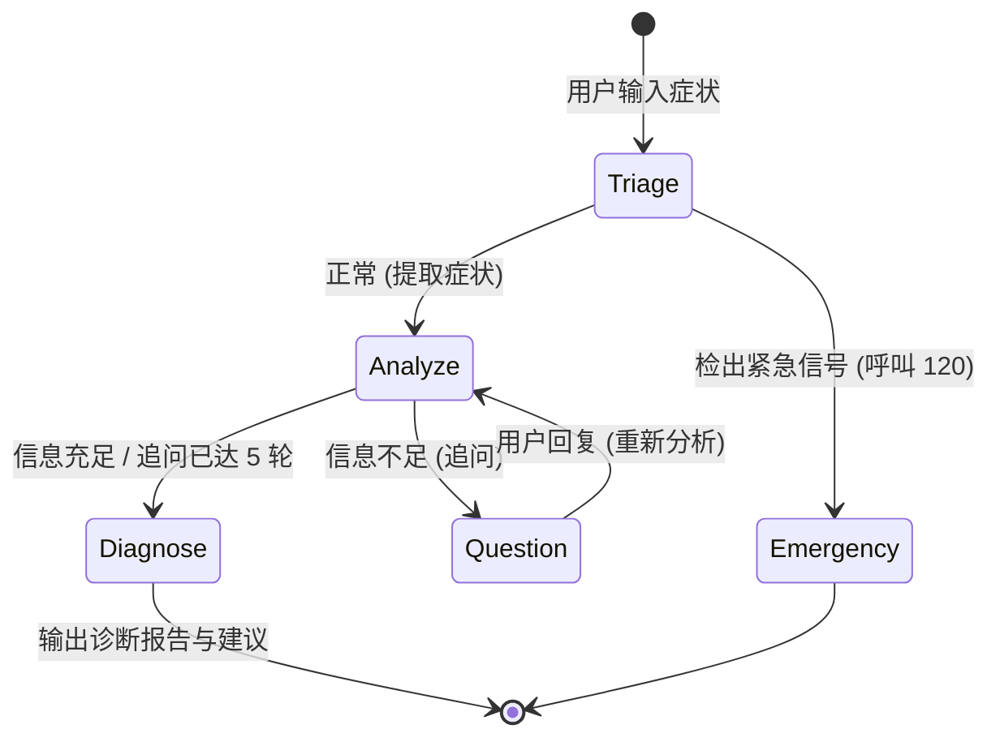

# 🩺 医疗健康助手 (Medical Agent)

AI 驱动的多 Agent 症状分析与健康咨询系统。系统基于 **LangGraph Supervisor** 模式实现多 Agent 协同，知识检索层采用进程内直接调用（零 IPC 开销），同时保留 **Model Context Protocol (MCP)** 接口用于外部集成（如 Claude Desktop），并基于 **pgvector (PostgreSQL)** 实现高精度的混合 RAG 检索，同时内置多维度的医疗用药安全红线拦截与生产级容灾防护。

---

## 🌟 核心特性

### 🤖 1. 多 Agent 协同编排 (LangGraph)
采用 Supervisor 集中编排模式，将问诊拆分为四大原子 Agent 节点：
* **急诊分诊 (Triage)**：前置 29 个红旗关键词零延迟过滤，结合 LLM 进行结构化急症判定，高危症状即刻触发 120 呼叫提示。
* **症状提取 (Symptom Analyzer)**：基于 Pydantic 提取结构化症状，自动进行实体合并与排重，支持前端标签化交互修改。
* **精准追问 (Questioner)**：根据现有症状库，自动追问持续时间、伴随症状、病史与过敏史，追问上限设为 5 轮，平衡体验与精度。
* **诊断报告 (Diagnose & Advise)**：整合知识库 RAG 上下文，一键生成结构化诊断建议，避免多次 LLM 带来的延迟。

### 📚 2. 知识检索服务
提供独立的 `medical_kb_mcp` 包，解耦核心知识层：
* **三个原子工具**：提供疾病匹配 (`search_diseases_by_symptoms`)、疾病详情 (`get_disease_detail`) 及指南语义检索 (`search_guidelines`)。
* **进程内直接调用**：FastAPI 后端通过 `app/services/kb_service.py` 直接导入并调用上述函数，共享数据库连接池，零 IPC 开销。
* **MCP 接口保留**：`medical_kb_mcp` 同时挂载为 MCP Server，支持 Claude Desktop（stdio 模式）等外部 MCP 客户端集成。

### 🔍 3. RAG 检索算法优化
* **密集与稀疏混合重排**：结合 pgvector 的 Cosine 相似度（占比 60%）和基于症状交集的 Dice 重叠系数（占比 40%）混合打分，兼顾语义理解与精准匹配。
* **元数据拼接前置**：在向量写入前将文档标题与段落拼接（`来自《...》：...`），解决独立切片丢失疾病主语的缺陷。
* **数据高保真**：去除了知识检索层对治疗详情和文献切片长度的硬性限制，确保 LLM 诊断能获取无损高保真的医学参考。

### 🛡️ 4. 生产级安全与合规
* **用药安全红线**：根据患者的年龄、孕产哺乳状态及过敏史，利用用药禁忌拦截器进行二次过滤，对不适用药物与过敏源输出醒目的强警示。
* **全生命周期防护**：前置 Prompt 注入防护；敏感日志脫敏；数据库凭据解耦。
* **双层鉴权**：本地 JWT (HS256) 与 API Key 双鉴权机制，实现 Session 级别的用户数据隔离。

### ⚡ 5. 高性能与优雅降级
* **二级缓存机制**：Redis 分层缓存诊断与检索结果；在 Redis 故障时，系统自动优雅降级为本地内存缓存（LRU 策略）。
* **Fail-Closed 限流**：默认使用 Redis 滑动窗口限流；若 Redis 宕机，自动退化为内存级滑动窗口限流，确保系统不被刷爆。
* **连接自愈与多级容灾**：数据库支持 `pool_pre_ping` 与 `pool_recycle` 自愈重连；LLM 客户端集成 API Key 多键随机轮询与 LangChain 原生 `with_fallbacks` 灾备模型自动切换，彻底防御外部接口限频。
* **向量检索索引优化**：系统启动时自动检测并在 pgvector `diseases` 向量列上按需构建 `HNSW` 空间索引，将检索复杂度从 $O(N)$ 降至 $O(\log N)$，极大降低高并发下的数据库 CPU 负载。
* **测试连接隔离**：测试环境自动切换为 `NullPool` 以规避 asyncpg 跨事件循环复用异常，并在 conftest 中自动注入 `vector` 扩展。
* **全链路日志可观测**：节点与检索层全面应用标准异步 `logging` 报错堆栈记录，杜绝历史 `print` 混用和解析异常时“默默吞错”的缺陷。

### 🗃️ 6. 动态知识库管理平台 (KB Management)
* **疾病库 CRUD**：支持对疾病条目、典型症状、就医指征的在线增删改查。症状更新时自动重算 1024 维语义特征向量。
* **指南自动切片导入**：支持长篇诊疗指南导入，以段落（`\n\n`）为粒度自动切片并提取来源元数据进行批量向量化写入。
* **RAG 检索评测沙箱**：在管理后台提供测试界面，直观比对和调试 Cosine 语义相关性分值与 Dice 症状重叠系数。

---

## 🛠️ 技术栈

* **后端**：FastAPI / SQLAlchemy 2.x + asyncpg / Alembic / LangGraph (Supervisor) / Uvicorn
* **AI & RAG**：DashScope (qwen-plus & text-embedding-v3) / pgvector 0.8.0 / MCP (Model Context Protocol)
* **缓存限流**：Redis 5.x / 7.x
* **前端**：Next.js 14 (App Router) / React 18 + TypeScript / Tailwind CSS / Server-Sent Events (SSE)

---

## 🚀 快速开始

### 1. 数据库准备 (PostgreSQL)
确保 PostgreSQL 已安装且开启了 `pgvector` 插件：
```sql
CREATE DATABASE medical_agent;
\c medical_agent
CREATE EXTENSION IF NOT EXISTS vector;
```

### 2. 后端启动
```bash
cd backend
# 安装依赖
pip install -r requirements.txt
# 配置文件 (填入 DashScope API Key, JWT 密钥等)
cp .env.example .env
# 数据库迁移
alembic upgrade head
# 灌入 25 种疾病种子数据 (自动计算并写入 embedding)
python -m medical_kb_mcp.seed_diseases
# 启动服务
python start.py
```
> 后端启动后将运行在 `http://localhost:8000`，可通过 `/health` 验证状态，在 `/docs` 查看交互式 Swagger 文档。

### 3. 前端启动
```bash
cd frontend
npm install
cp .env.example .env.local
npm run dev
```
> 访问 `http://localhost:3000` 即可开始问诊体验。

### 4. 挂载 Claude Desktop (可选)
复制 `claude_desktop_config.example.json` 内容至 Claude Desktop 配置中，将路径替换为绝对路径即可让 Claude 拥有本地医学库检索能力。详情参考：[MCP Server 运行指南](backend/medical_kb_mcp/README.md)。

---

## 🔀 系统架构与工作流

### 架构拓扑

### 状态流转图

###  项目效果


## 📊 自动化评测 (E2E & CI)

系统自带了一套评测引擎，内置 35 个真实问诊 Case，支持 Mock 模式（用于 CI）和 Real 模式（调用真实模型与 DB 评估）。

```bash
cd backend
# 运行评估单测
python -m pytest evals/test_eval.py -v -s
```

### 核心评估指标
* 🎯 **诊断命中率** (目标 ≥60%，当前 **92.0%**)：Top-3 结果中是否包含目标疾病。
* 🔄 **平均追问轮数** (目标 <3.0，当前 **0.7 轮**)：到达诊断阶段前，Questioner 节点执行的平均次数。
* 🚨 **急症召回率** (目标 100%，当前 **100.0%**)：急症患者被正确分类为紧急的比例。
* 🔍 **急症精确度** (目标 100%，当前 **100.0%**)：被分类为紧急的患者中，真正属于急症的比例。

---

## 📂 项目结构

```
.
├── 知识库设计.md               # 动态知识库管理与 RAG 架构设计文档
├── backend/
│   ├── app/                    # FastAPI 核心业务代码
│   │   ├── nodes/              # LangGraph Agent 节点 (Triage/Analyze/Questioner/Diagnose)
│   │   ├── routers/            # API 端点 (问诊、历史、用户管理、知识库管理 kb.py)
│   │   ├── services/           # 业务服务层 (kb_service 直接调用知识库，零 IPC 开销)
│   │   ├── rag/                # RAG 检索编排层
│   │   ├── safety_rules.py     # 用药安全校验拦截器
│   │   └── security.py         # Prompt 注入防护与安全净化
│   ├── medical_kb_mcp/         # 独立 MCP Server (含 pgvector 疾病/指南检索逻辑)
│   ├── evals/                  # 评测用例集与运行引擎
│   ├── alembic/                # 数据库迁移脚本
│   ├── data/guidelines/        # 诊疗指南 Markdown 数据源
│   └── requirements.txt
├── frontend/
│   ├── src/
│   │   ├── app/                # Next.js 页面与路由 (包含 /admin/kb 知识库管理面板)
│   │   ├── components/         # 问诊状态机 UI 组件 (进度指示、症状更正标签)
│   │   ├── api/                # 前端 API 客户端 (client.ts & kb.ts)
│   └── next.config.js
└── docker-compose.yml           # 一键集成部署配置
```
