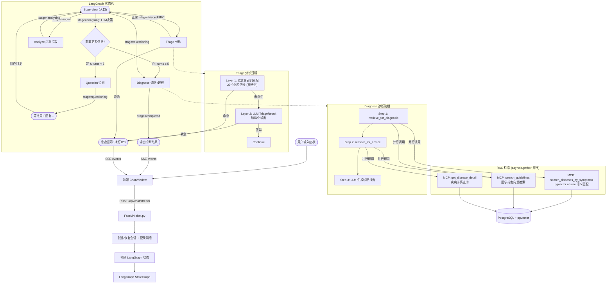
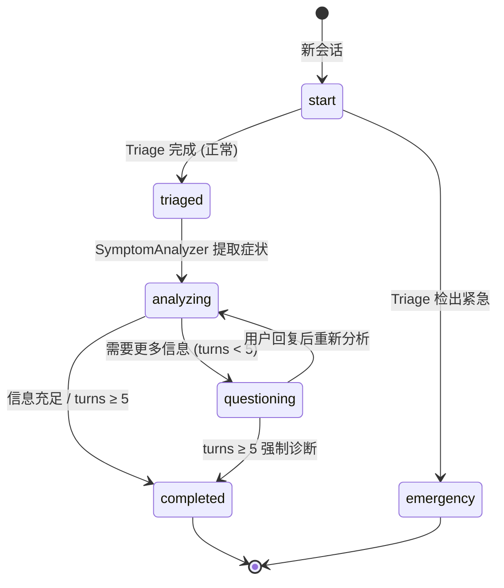

# 医疗健康助手

AI 驱动的多 Agent 症状分析与治疗建议系统。基于 LangGraph Supervisor 模式实现多 Agent 协作，MCP 协议解耦知识层，Pydantic 结构化输出保证数据质量。疾病匹配使用 pgvector 语义相似度（DashScope embedding），支持同义词/近义词症状识别。

## 技术栈

### 后端

| 技术 | 用途 |
|---|---|
| FastAPI | Web 框架 |
| SQLAlchemy 2.x + asyncpg | 异步 ORM |
| PostgreSQL 17 | 主数据库 |
| pgvector 0.8.0 | 向量检索 |
| Alembic | 数据库迁移 |
| LangGraph | 多 Agent 状态机 |
| LangGraph Supervisor | Supervisor 多 Agent 编排 |
| LangGraph Checkpoint Postgres | 对话状态持久化 |
| Uvicorn | ASGI 服务器 |

### AI / RAG

| 技术 | 用途 |
|---|---|
| DashScope API (qwen-plus) | LLM（OpenAI 兼容接口） |
| DashScope text-embedding-v3 | 文本向量化（1024 维） |
| LangChain | RAG 流程编排 |
| langchain-postgres (PGVector) | 向量存储与检索 |
| MCP (Model Context Protocol) | 知识层封装（Claude Desktop 通过 stdio 消费） |
| Pydantic 结构化输出 | 症状提取 + 分诊输出 |

### 前端

| 技术 | 用途 |
|---|---|
| Next.js 14 (App Router) | React 框架 |
| React 18 + TypeScript | UI |
| Tailwind CSS 3.3 | 样式 |
| 原生 fetch + SSE | HTTP 与流式通信 |

## 快速开始

### 1. PostgreSQL + pgvector

确保 PostgreSQL 运行在 `localhost:5432`，然后：

```sql
CREATE DATABASE medical_agent;
\c medical_agent
CREATE EXTENSION IF NOT EXISTS vector;
```

### 2. 后端

```bash
cd backend
pip install -r requirements.txt
cp .env.example .env   # 编辑 .env 填入 DashScope API Key
alembic upgrade head   # 创建数据库表
python -m medical_kb_mcp.seed_diseases   # 灌入 25 种疾病数据 + 自动生成 embedding（幂等）
```

> **关于指南向量库**：`search_guidelines` 读取**已存在**的 `medical_guidelines` 向量集合。全新空库下该集合为空，指南检索会**优雅降级为空结果**（结构化疾病检索不受影响）。重新 ingest `data/guidelines/*.md` 是 M1 之后的跟进项，详见 [`backend/medical_kb_mcp/README.md`](backend/medical_kb_mcp/README.md)。

启动 FastAPI 应用：
```bash
uvicorn app.main:app --reload --port 8000
# Windows 已在 app/main.py 顶部设置 SelectorEventLoop，直接 uvicorn 即可
```

### 3. 前端

```bash
cd frontend
npm install
npm run dev
```

访问 http://localhost:3000

### 4. Claude Desktop 集成

MCP Server 同时支持 stdio 模式，可直接挂载到 Claude Desktop：

```json
{
  "mcpServers": {
    "medical-kb": {
      "command": "python",
      "args": ["-m", "medical_kb_mcp.server"],
      "cwd": "你的路径/backend"
    }
  }
}
```

## 环境变量

后端配置全部走 `backend/.env`（复制自 `.env.example`）：

| 变量 | 用途 | 默认 / 示例 |
|---|---|---|
| `LLM_API_KEY` | DashScope API Key（LLM 与嵌入共用） | 必填 |
| `LLM_MODEL` | 对话模型 | `qwen-plus` |
| `LLM_BASE_URL` | LLM OpenAI 兼容端点 | DashScope compatible-mode |
| `DATABASE_URL` | Postgres 连接串（asyncpg 驱动） | `postgresql+asyncpg://...:5432/medical_agent` |
| `EMBEDDING_MODEL` | 嵌入模型（1024 维） | `text-embedding-v3` |
| `EMBEDDING_BASE_URL` | 嵌入端点 | DashScope compatible-mode |
| `DATA_DIR` | 指南 `.md` 数据目录 | `./data` |
| `API_KEY` | API 鉴权密钥；**留空则关闭鉴权（开发模式）** | — |
| `CORS_ORIGINS` | 允许的前端来源（逗号分隔） | `http://localhost:3000,...` |
| `SQL_ECHO` | 是否打印 SQL | `false` |
| `LANGCHAIN_TRACING_V2` | 开启 LangSmith 追踪 | `false` |
| `LANGCHAIN_API_KEY` | LangSmith Key | — |
| `LANGCHAIN_PROJECT` | LangSmith 项目名 | `medical-agent` |
| `MCP_HOST` / `MCP_PORT` | MCP server 监听地址（Claude Desktop 用） | `127.0.0.1` / `8765` |

## 项目结构

```
backend/
├── app/
│   ├── config.py           # Pydantic Settings 配置
│   ├── database.py         # SQLAlchemy 异步引擎
│   ├── models.py           # ORM 模型（5 张业务表）
│   ├── schemas.py          # Pydantic 请求/响应模型
│   ├── state.py            # LangGraph 状态定义（含急诊字段）
│   ├── graph.py            # Supervisor 多 Agent 路由
│   ├── main.py             # FastAPI 入口 + lifespan + /health
│   ├── auth.py             # API Key 认证（hmac.compare_digest）
│   ├── llm.py              # LLM 实例工厂（带缓存）
│   ├── summarizer.py       # 对话摘要机制（>12 条消息触发）
│   ├── cache.py            # 诊断结果缓存（1h TTL）
│   ├── nodes/              # Agent 节点
│   │   ├── triage.py           # 分诊/急诊 Agent（确定性红旗检测 + LLM）
│   │   ├── symptom_analyzer.py # 症状提取（Pydantic 结构化输出）
│   │   ├── questioner.py       # 追问 Agent
│   │   ├── disease_matcher.py  # 疾病匹配（结构化 JSON + 缓存）
│   │   ├── advisor.py          # 治疗建议 Agent
│   │   └── diagnose_and_advise.py # 诊断+建议合并节点
│   ├── rag/                # RAG 检索（直接调用知识层函数）
│   │   └── retriever.py        # 调 medical_kb_mcp → 拼 context
│   └── routers/            # API 路由
│       ├── chat.py         # 对话（含 SSE 流式 + 进度事件）
│       ├── history.py      # 历史记录
│       └── symptoms.py     # 症状列表
├── medical_kb_mcp/         # 独立 MCP Server（可独立部署）
│   ├── server.py           # FastMCP 应用 + 3 个原子工具
│   ├── db.py               # Postgres 疾病表访问（embedding 语义匹配）
│   ├── vectors.py          # pgvector + DashScope 嵌入
│   ├── models.py           # Disease ORM 模型
│   ├── config.py           # MCPSettings（读同一 .env）
│   └── seed_diseases.py    # 25 种疾病种子数据
├── start.py                # 启动脚本（单进程启动 FastAPI）
├── evals/                  # Eval 工具
│   ├── dataset.py          # 35 个 eval case（25 正常 + 5 急诊 + 5 模糊）
│   ├── runner.py           # eval 执行引擎（mock / real 两种模式）
│   ├── metrics.py          # 指标计算（命中率/追问轮数/急症召回率）
│   └── test_eval.py        # pytest 集成
├── alembic/                # 数据库迁移
├── data/guidelines/        # 医学指南（9 篇 .md）
└── requirements.txt

frontend/
├── src/
│   ├── app/                # Next.js 页面
│   ├── api/client.ts       # API 客户端
│   ├── types/index.ts      # TypeScript 类型
│   ├── hooks/              # 自定义 Hook
│   │   ├── useChat.ts          # 聊天状态管理
│   │   └── useSession.ts       # 会话管理
│   └── components/         # UI 组件
└── next.config.js          # API 代理
```

## 多 Agent 架构（M2）

系统采用 **Supervisor 多 Agent 模式**，每个 Agent 有明确职责：

### 系统工作流程图



### 状态流转说明



### 节点职责

| Agent | 职责 | 技术特点 |
|---|---|---|
| **Supervisor** | 路由决策 | 确定性路由（基于 stage）+ LLM 兜底（仅 analyzing 阶段），LangSmith 可见 |
| **Triage** | 急诊检测 | Layer 1: 确定性红旗关键词（29 个，零延迟）+ Layer 2: LLM `TriageResult` 结构化输出 |
| **Analyze** | 症状提取 | Pydantic `SymptomExtraction` 结构化输出，自动去重合并已有症状 |
| **Question** | 追问 | 最多 5 轮，聚焦: 症状持续时间/伴随症状/病史/过敏史 |
| **Diagnose** | 诊断+建议 | MCP RAG 检索（并行）→ LLM 一次性生成完整报告 |

### 关键设计决策

1. **确定性优先**: Supervisor 在 4/5 个路由点使用确定性判断，仅在 `analyzing` 阶段引入 LLM 决策（是否需要追问），减少延迟和幻觉风险
2. **双层急诊检测**: Triage 先做零延迟关键词匹配，命中即短路；未命中才调 LLM，兼顾速度和覆盖率
3. **合并诊断节点**: `diagnose_and_advise` 将疾病匹配和治疗建议合并为单节点单次 LLM 调用，减少延迟
4. **并行 RAG**: `asyncio.gather` 同时发起疾病匹配和指南检索，最大化吞吐
5. **状态持久化**: `AsyncPostgresSaver` 实现多轮对话状态持久化，会话可跨服务重启恢复

## MCP Server（M1）

`medical_kb_mcp` 包提供 3 个原子工具，App 侧直接函数调用，Claude Desktop 通过 stdio 消费：

| 工具 | 用途 |
|---|---|
| `search_diseases_by_symptoms` | 症状→疾病匹配（pgvector cosine 语义相似度） |
| `get_disease_detail` | 疾病详情查询 |
| `search_guidelines` | 医学指南语义检索（pgvector + DashScope） |

App 侧直接调用 `medical_kb_mcp.db` / `vectors` 模块的函数，无需启动独立进程。Claude Desktop 通过 stdio 模式挂载（见下方集成配置）。

### MCP 工具契约

| 工具 | 入参 | 返回 |
|---|---|---|
| `search_diseases_by_symptoms` | `symptoms: list[str]`, `limit: int` | `list[DiseaseMatch]`（pgvector cosine 相似度排序） |
| `get_disease_detail` | `name: str` | `DiseaseDetail \| None` |
| `search_guidelines` | `query: str`, `k: int` | `list[GuidelineChunk]` |

### 数据流

```
diagnose 节点 ─┐
advise 节点  ─┤→ app/rag/retriever.py ─┐  (asyncio.gather 并行)
              │    (直接函数调用)        ├─► medical_kb_mcp.db    ─► pgvector(diseases 表, cosine 相似度)
              │                          └─► medical_kb_mcp.vectors ─► pgvector(guidelines 集合)
Claude Desktop ─(stdio)──► medical_kb_mcp.server ─┘
```

## RAG 优化：Embedding 语义匹配

M1 的疾病症状匹配使用 PostgreSQL `overlap` + Dice 系数，只做精确字符串匹配。`"头疼"` 和 `"头痛"` 被视为完全不同的症状。

重构后改为 **pgvector cosine 语义相似度**（DashScope `text-embedding-v3`，1024 维）：

| 阶段 | 操作 |
|---|---|
| 写入 | `"、".join(疾病症状)` → DashScope embedding → `symptom_embedding` 列 |
| 查询 | `"、".join(用户症状)` → DashScope embedding → pgvector cosine 搜索 |

- 阈值过滤：`SIMILARITY_THRESHOLD = 0.3`
- `matched_symptoms` 交集信息保留作为辅助参考
- Seed 自动生成：新疾病插入时生成 embedding，已有疾病 `symptom_embedding` 为 None 时自动补算
- 检索并行化：`retriever.py` 中结构化匹配与向量检索用 `asyncio.gather` 并行

## Eval 工具（M3）

```bash
cd backend
python -m pytest evals/test_eval.py -v -s
```

四个核心指标：

| 指标 | 计算方式 | 当前值 | 目标 |
|---|---|---|---|
| 诊断命中率 | expected_disease ∈ Top-3 results | 92.0% | ≥60% |
| 平均追问轮数 | start→diagnose 间的 question 节点数 | 0.7 | <3.0 |
| 急症召回率 | emergency case 中被正确检出的比例 | 100.0% | 100% |
| 急症精确度 | 被检出为急诊中真正急诊的比例 | 100.0% | 100% |

支持 mock（快速 CI）和 real（完整 E2E）两种模式。

## 数据库

| 表 | 说明 |
|---|---|
| `users` | 用户 |
| `sessions` | 问诊会话 |
| `messages` | 对话消息 |
| `symptom_categories` | 症状分类 |
| `symptoms` | 症状 |
| `diseases` | 疾病知识库（25 种，含症状 embedding，MCP Server 管理） |
| `langchain_pg_*` | pgvector 向量数据 |
| `checkpoints*` | LangGraph 状态 |

## API

| 方法 | 路径 | 说明 |
|---|---|---|
| POST | `/api/chat` | 发送消息 |
| POST | `/api/chat/stream` | SSE 流式对话 |
| GET | `/api/history` | 会话列表 |
| GET | `/api/history/{id}` | 会话详情 |
| DELETE | `/api/history/{id}` | 删除会话 |
| GET | `/api/symptoms` | 症状分类 |
| GET | `/health` | 健康检查（数据库/连接池/LangGraph/缓存） |

### 鉴权

除 `/health` 外，所有 `/api/*` 路由都通过路由级依赖 `verify_api_key` 校验请求头 `X-API-Key`（值取 `.env` 的 `API_KEY`）。若 `.env` 未设置 `API_KEY`，则**跳过校验（开发模式）**。

```bash
curl -H "X-API-Key: $API_KEY" http://localhost:8000/api/symptoms
```

## 测试

```bash
cd backend

# 全量测试（不含需要数据库的 API/集成测试）
python -m pytest tests/ -v --ignore=tests/test_api.py --ignore=tests/test_integration.py

# Eval 测试
python -m pytest evals/test_eval.py -v -s

# 单独模块测试
python -m pytest tests/test_triage.py -v
python -m pytest tests/test_symptom_analyzer_structured.py -v
```

### 测试覆盖

| 模块 | 测试文件 | 测试数 |
|---|---|---|
| Triage Agent | `tests/test_triage.py` | 16 |
| Symptom Analyzer | `tests/test_symptom_analyzer_structured.py` | 8 |
| MCP Server | `tests/test_mcp_*.py` | 11 |
| Eval | `evals/test_eval.py` | 9 |
| **总计** | | **44** |

> 上表为业务 / MCP / Eval 单测，不含 `tests/test_api.py`(4) 与 `tests/test_integration.py`(1)——这两个文件默认失败（需 `X-API-Key` 鉴权 + asyncpg 事件循环问题），属环境依赖而非回归，故未计入。

## 已知限制

| 项 | 说明 | 影响 |
|---|---|---|
| 指南重新入库 | M1 删除了进程内入库逻辑，`vectors.py` 改为 `PGVector.from_existing_index` 读已存在集合；尚无 `data/guidelines/*.md` → `medical_guidelines` 的 ingest 脚本 | 全新空库下 `search_guidelines` 优雅降级为空结果，结构化疾病检索不受影响 |
| 迁移残留 | `backend/chroma_db/`（ChromaDB→pgvector 遗留）、`medical_agent*.db`（SQLite→Postgres 遗留） | 建议加 `.gitignore` 或直接删除 |
| Real-mode eval 前置 | `runner.py` 的 real 模式需 live Postgres + DashScope；CI 走 mock 模式 | 完整 E2E 指标需本地起全套依赖才能复现 |
