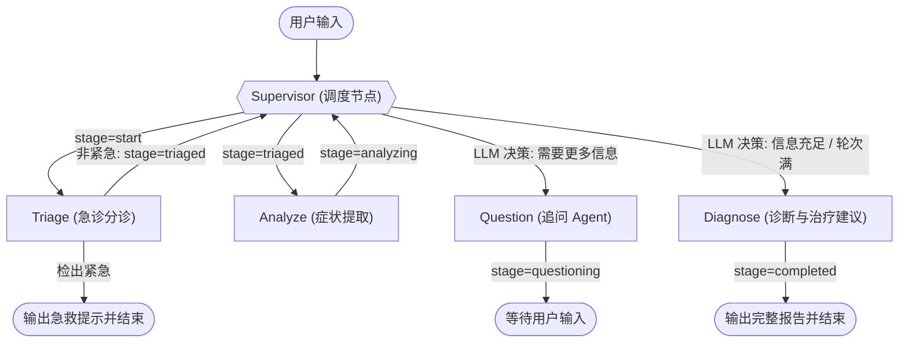

# 医疗健康助手项目运行流程

本项目是一个基于 AI 驱动的多 Agent 症状分析与治疗建议系统。它采用 Next.js (前端) + FastAPI (后端) 架构，并基于 LangGraph Supervisor 模式实现多 Agent 状态机协同，通过 MCP (Model Context Protocol) 协议连接医学知识检索层 (RAG)。

以下是该项目的核心运行流程，主要分为五个阶段：

---

### 1. 用户输入与入口处理（鉴权、限流与会话记录）
1. **前端请求**：用户在 Next.js 前端输入症状描述，点击发送。前端向后端 `/api/chat/stream`（流式接口，定义在 [chat.py](file:///C:/Users/Administrator/Desktop/医疗agent/backend/app/routers/chat.py#L212)）发送 POST 请求，并携带 `session_id`。
2. **中间件校验**：
   - **鉴权**：后端在 [auth.py](file:///C:/Users/Administrator/Desktop/医疗agent/backend/app/auth.py) 中验证用户凭证（支持 Supabase JWT 验证与向后兼容 of API Key）。
   - **限流**：基于 Redis 滑动窗口在 [chat.py](file:///C:/Users/Administrator/Desktop/医疗agent/backend/app/routers/chat.py#L21) 中进行流量限制，防止接口被恶意刷量。
3. **数据库记录**：若为新会话，则创建新 `session`；同时将用户的原始输入保存到 PostgreSQL 的 `messages` 表中（定义在 [models.py](file:///C:/Users/Administrator/Desktop/医疗agent/backend/app/models.py)）。

---

### 2. 状态加载与上下文整理（Context Reset & Summary）
在将消息传递给 LangGraph 状态机之前，后端会先在 [chat.py](file:///C:/Users/Administrator/Desktop/医疗agent/backend/app/routers/chat.py) 中进行上下文的智能管理：
- **历史摘要 (Summarization)**：如果当前会话历史消息超过 12 条，系统会调用 [summarizer.py](file:///C:/Users/Administrator/Desktop/医疗agent/backend/app/summarizer.py) 生成对话摘要，并将历史消息剪枝，保留关键系统摘要和最新对话，防止 Token 溢出并降低延迟。
- **诊断后重置 (Reset Context)**：如果上一次交互中 `current_stage` 已经是 `"completed"`（代表上一轮诊断已完成），但用户又发起了新提问，系统会触发重置机制。它会清除旧对话上下文，但**保留已识别的症状和诊断结论**作为背景参考，重新将状态机的 `current_stage` 设为 `"start"` 开始新一轮 analysis。

---

### 3. LangGraph Supervisor 状态机流转流程
系统在 [graph.py](file:///C:/Users/Administrator/Desktop/医疗agent/backend/app/graph.py) 中构建并运行一个以 [MedicalAgentState](file:///C:/Users/Administrator/Desktop/医疗agent/backend/app/state.py) 作为共享状态的流程图。具体执行节点如下：

#### 各节点详细工作机制：
1. **Supervisor 调度节点 ([supervisor_node](file:///C:/Users/Administrator/Desktop/医疗agent/backend/app/graph.py#L45))**：
   - 采用确定性与 LLM 混合路由机制。对于大部分明确阶段（如刚开始、已分诊、已追问），直接使用确定性代码路由（[_deterministic_route](file:///C:/Users/Administrator/Desktop/医疗agent/backend/app/graph.py#L90)），避免调用 LLM 带来的延迟和幻觉。
   - 仅在 `"analyzing"` 阶段利用 LLM 判定当前收集的信息是否充足。若不充足且交互轮次 `< 5` 轮，则路由至 `question`，否则路由至 `diagnose`。
2. **Triage 急诊检测节点 ([run_triage](file:///C:/Users/Administrator/Desktop/医疗agent/backend/app/nodes/triage.py#L71))**：
   - **第一层（确定性红旗关键词匹配）**：零延迟匹配输入中是否含有 29 个危急重症词汇（如"胸痛"、"呼吸困难"等）。一旦命中，直接流转至 `"emergency"` 状态，给出急救电话和应对措施并强行中断流程。
   - **第二层（LLM 语义分诊）**：若无直接匹配，则调用 LLM 进行结构化输出分析，判断隐性的急诊风险。若检测出紧急情况，亦会进入短路流程；否则设置 `current_stage` 为 `"triaged"`，返回 Supervisor。
3. **Analyze 症状提取节点 ([analyze_symptoms](file:///C:/Users/Administrator/Desktop/医疗agent/backend/app/nodes/symptom_analyzer.py#L32))**：
   - 调用 LLM 对用户输入进行 Pydantic 结构化输出提取（`SymptomExtraction`），分离出具体的症状列表。
   - 与历史已识别症状进行自动去重合并，更新 `symptoms` 状态，并将 `current_stage` 改为 `"analyzing"`。
4. **Question 追问节点 ([generate_question](file:///C:/Users/Administrator/Desktop/医疗agent/backend/app/nodes/questioner.py))**：
   - 生成针对伴随症状、持续时间、病史或过敏史等方面的追问问题。
   - 更新状态为 `"questioning"` 并直接结束当前 Graph 执行，等待用户下一次输入。
5. **Diagnose 诊断与建议节点 ([diagnose_and_advise](file:///C:/Users/Administrator/Desktop/医疗agent/backend/app/nodes/diagnose_and_advise.py))**：
   - 当 Supervisor 判定无需追问或交互到达第 5 轮上限时，流程路由到此节点。该节点是系统最核心的 RAG 与报告生成中心。

---

### 4. 基于 MCP 协议的并行 RAG 检索
在 `diagnose_and_advise` 节点执行时，后端通过 MCP Client 并行发起工具调用（RAG）：
1. **并行检索**：利用 `asyncio.gather` 并行调用 [server.py](file:///C:/Users/Administrator/Desktop/医疗agent/backend/medical_kb_mcp/server.py) 提供的 MCP 工具：
   - [search_diseases_by_symptoms](file:///C:/Users/Administrator/Desktop/医疗agent/backend/medical_kb_mcp/server.py)：通过 **pgvector 余弦相似度**（使用 DashScope `text-embedding-v3` 进行 1024 维向量匹配）检索出匹配度最高的疾病。
   - [search_guidelines](file:///C:/Users/Administrator/Desktop/医疗agent/backend/medical_kb_mcp/server.py)：检索相关的诊疗指南文本块。
   - [get_disease_detail](file:///C:/Users/Administrator/Desktop/医疗agent/backend/medical_kb_mcp/server.py)：获取疾病的详细临床表现。
2. **报告生成**：LLM 整合上述检索到的知识库上下文、指南规范和用户提取的症状，生成一份包含**疑似疾病、可能性评分、建议就诊科室、伴随症状解释以及详细治疗/预防方案**的结构化诊断报告。

---

### 5. 流式输出、状态持久化与缓存
1. **流式 SSE 响应**：后端将 Agent 内部的状态变化（如 `stage` 转移）及 LLM 诊断报告/追问文本，通过 Server-Sent Events (SSE) 协议，高实时性地流式推送至 Next.js 前端，增强用户交互体验。
2. **数据落地与更新**：
   - 助理回复记录持久化到 `messages` 数据库表。
   - 诊断结论写回到 `sessions` 表的 `diagnosis` 字段。
3. **多级持久化与缓存机制**：
   - **会话持久化**：使用 LangGraph 的 `AsyncPostgresSaver` 将整个运行状态（包括完整的 Agent 变量及 Message 链路）存储在数据库中，支持会话的跨服务重启及恢复。
   - **多级缓存 (Redis + 内存)**：检索结果与诊断报告会缓存至 Redis（无 Redis 时自动降级为内存缓存），提升后续相同请求的响应速度。

---

### 💡 设计亮点总结
- **确定性路由优先**：避免盲目调用 LLM 路由，极大降低了系统的非必要延迟和运行成本。
- **双层急诊匹配 (Double-Layer Triage)**：零延迟词库匹配防漏检，LLM 兜底防模糊，把患者安全放在第一位。
- **语义相似度匹配 (pgvector Vector Search)**：支持同义词和近义词症状识别，解决了传统精确匹配无法处理类似“头疼”与“头痛”含义相同的问题。
- **并行化 RAG 调用**：MCP 服务工具调用在异步线程中并发执行，最大化系统的并发吞吐率。
