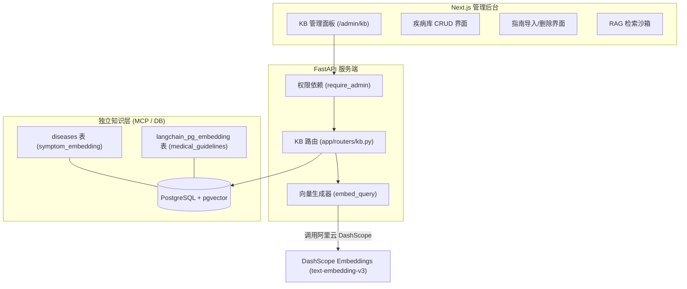

# 🩺 医疗健康助手 - 知识库管理系统设计文档

本文档详细阐述了「医疗健康助手」中**知识库管理系统 (Knowledge Base Management System)** 的架构、数据库模型、API 端点、前端界面设计及 RAG 索引同步机制。

---

## 🗺️ 1. 系统架构与工作流

知识库管理系统旨在提供完整的**疾病库维护 (CRUD)** 与**国家诊疗指南物理片段扩充 (Vector Ingestion)** 能力。通过将原本静态种子数据升级为动态向量化管理，辅助 Agent 在进行问答诊断时获得更新颖、更权威的上下文支持。

### 1.1 系统拓扑结构


### 1.2 诊疗指南文档向量化管道
当管理员录入一篇新的长篇诊疗指南时，数据处理与向量化管道的流转过程如下：
```mermaid
flowchain
    AdminSubmit["管理员输入标题与正文"]
    Split["以段落 (\n\n) 为界限进行语义物理切分"]
    Meta["为每个切片拼接来源元数据: 来自《...》：正文"]
    CallEmbedding["批量调用 DashScope 向量生成 (DashScopeEmbeddings)"]
    SaveVector["写入 PGVector 数据库并构建 HNSW/Cosine 索引"]
```

---

## 🗄️ 2. 数据库模型设计

系统包含两个独立的存储实体，一个对应于强结构化的疾病诊断实体，另一个对应于非结构化的段落指南向量存储。

### 2.1 疾病实体表 (`diseases`)
用于在多 Agent 协同问答过程中，计算症状交集 Dice 系数，以及进行向量匹配打分。
*   **`id`** (`String`, 主键): 自动生成的 UUID。
*   **`name`** (`String`, 唯一且带索引): 疾病名称，如 "普通感冒"。
*   **`symptoms`** (`ARRAY(Text)`, GIN 索引): 疾病的典型症状列表，如 `['发热', '咳嗽', '流涕']`。
*   **`symptom_embedding`** (`Vector(1024)`): 针对所有症状用“、”拼接后的语义向量表示，基于 DashScope `text-embedding-v3` 1024 维。
*   **`description`** (`Text`): 疾病详情简述。
*   **`treatment`** (`Text`): 默认推荐的对症治疗方案。
*   **`when_to_see_doctor`** (`Text`): 就医危险指征（如高热持续 3 天以上等）。
*   **`severity`** (`String`): 严重程度等级，如 `轻`、`中`、`重` 等。

### 2.2 诊疗指南切片表 (`langchain_pg_embedding`)
由 LangChain `PGVector` 内部管理，结构包括：
*   **`uuid`** (`UUID`, 主键): 段落切片唯一标识。
*   **`document`** (`Text`): 处理后的段落文本，前置标题元数据，如 `来自《高血压防治指南》：收缩压 ≥ 140mmHg 或舒张压 ≥ 90mmHg...`。
*   **`embedding`** (`Vector(1024)`): 该段落对应的 1024 维密集特征向量。
*   **`cmetadata`** (`JSONB`): 关联的切片属性，包含 `{"title": "xxx", "source": "admin_upload"}`。

---

## 🔌 3. RESTful API 接口定义

知识库 API 全生命周期处于 `require_admin` 安全拦截器保护下，外部请求必须包含有效的 JWT Token，且调用者用户的 `role` 字段必须为 `"admin"`。

| HTTP 方法 | 请求路径 | 描述 |
| :--- | :--- | :--- |
| **`GET`** | `/api/kb/stats` | 获取知识库当前总览数据（疾病数、已生成向量数、指南切片数） |
| **`GET`** | `/api/kb/diseases` | 列出或按关键字检索疾病（支持分页） |
| **`GET`** | `/api/kb/diseases/{id}` | 获取特定疾病的完整详情定义 |
| **`POST`** | `/api/kb/diseases` | 新建疾病，系统将**同步自动生成**其症状语义 Embedding 并入库 |
| **`PUT`** | `/api/kb/diseases/{id}` | 更新疾病细节，若症状数组变更，则**触发向量重新生成机制** |
| **`DELETE`** | `/api/kb/diseases/{id}`| 从系统物理删除该疾病及其向量 |
| **`GET`** | `/api/kb/guidelines` | 分页列出或正文匹配当前存在的所有指南向量切片数据 |
| **`POST`** | `/api/kb/guidelines` | 导入多段落指南文档，**执行切片、拼装、DashScope embedding 并批量追加**至向量库 |
| **`DELETE`** | `/api/kb/guidelines/{id}`| 物理删除特定 UUID 关联的指南切片 |
| **`POST`** | `/api/kb/search/test` | RAG 检索诊断沙箱测试，允许预览 RAG 返回分值，用于评估和调优打分权重 |

---

## 🖥️ 4. 前端管理面板实现

前端管理面板采用极其扁平化的现代化暗色/亮色自适应架构，构建于 Next.js 中，提供三大工作区：

### 4.1 疾病维护区 (Disease Management)
1.  **卡片统计指示器**：直观展示当前疾病库的总量、完成向量化嵌入的覆盖度，以百分比或色彩区分工作状态。
2.  **标签化症状输入**：在新增/编辑疾病弹窗中，管理员可以通过键盘“、”或“,”分隔符号，自动构建标签并录入典型症状数组。
3.  **智能异步更新**：提交后立即展示计算向量状态，保证更新的平滑呈现。

### 4.2 指南文档导入区 (Guideline Ingestion)
1.  **段落智能微调**：文本输入框允许直接键入包含多个换行的临床规范，系统后台会自动以双换行 `\n\n` 切分为段落。
2.  **来源追溯保障**：强制要求指定指南名称或出处，数据切片时自动前置拼装，预防切片丢失主语。
3.  **流式写入提示**：采用 loading 骨架与 loading toast 提示，保障批量计算 embedding 时的良好交互体验。

### 4.3 检索沙箱评测区 (RAG Sandbox)
*   **直接交互式评测**：管理员键入用户问诊的自然语言（如 "发热伴有严重咳痰、咽喉肿痛"）。
*   **可视化分值仪表**：系统呈现从 `PGVector` 获得的内容相似度 Cosine Score，或疾病匹配混合打分（60% Cosine Similarity + 40% Dice overlap coeff.）。
*   **一键全量导出/预览**：帮助研发与医学主管校验红线规则前置诊断匹配效果。

---

## 🛡️ 5. 安全与高性能设计

1.  **分流非阻塞式运行**：由于批量计算 Embedding 是高延时的 I/O 操作，服务端对于 Guidelines 批量操作及 Diseases 增改操作，全部采用 `asyncio.to_thread` 分派到额外工作线程池中，保护 FastAPI 核心单线程异步循环性能。
2.  **错误降级保护**：当阿里云 DashScope API 访问异常或限制超速 (Rate Limit) 时，疾病的保存操作仍会成功，仅将 embedding 置为 `None`，并在状态中标记“未就绪”，确保数据不会丢失，待服务恢复后可重新保存触发 embedding。
3.  **彻底的防注入与越权拦截**：所有路径皆强制进行依赖校验 `require_admin`，前置拦截非法角色、未登录用户及普通用户对医学数据库的修改，日志中也进行了敏感元数据的脱敏。
